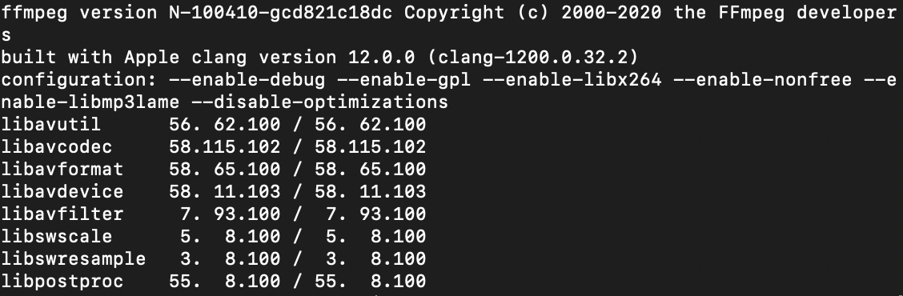

# Compile ffmpeg in Mac

### My system version

### Download & Compile ffmpeg
1. download ffmpeg from [homepage](https://ffmpeg.org/download.html) `https://ffmpeg.org/download.html`
2. you can choose donwload by rar or git.
    for me, i download by git as below command.
    `git clone https://git.ffmpeg.org/ffmpeg.git ffmpeg`
3. compile by command. you can get options from [here](https://ffmpeg.org/platform.html#Darwin-_0028Mac-OS-X_002c-iPhone_0029) `https://ffmpeg.org/platform.html#Darwin-_0028Mac-OS-X_002c-iPhone_0029`
    and you can find compile suggestion from [wiki](https://trac.ffmpeg.org/wiki/CompilationGuide) `https://trac.ffmpeg.org/wiki/CompilationGuide`

    for me, because i want to read the ffmpeg source code, so i add `debug` option. like:
    `./configure --enable-debug`
    `make -j8`

    you can compile according to your requirements.

4. after success, you can see the ffmpeg version by `ffmpeg -version`.

    