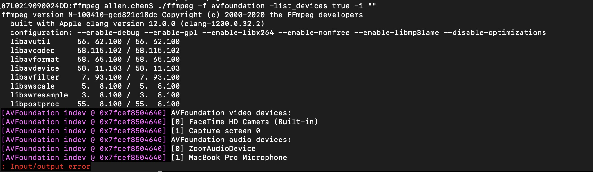

# List Devices On Mac

## By API
I want to list all devcies on my mac, and choose to recod audio or vido. so first i read the document and hope use the API to print it. This is the code i used.

```C
#include <stdlib.h>
extern "C"{
#include "libavformat/avformat.h"
#include "libavdevice/avdevice.h"
}

AVProbeData* pdata = NULL;

int main(int argc, const char * argv[]) {
    //register all devices
    avdevice_register_all();
    
    AVInputFormat *iformat = NULL;
    
    do{
        iformat = av_input_video_device_next(iformat);
        AVDeviceInfoList *list = NULL;
        
        avdevice_list_input_sources(iformat, NULL, NULL, &list);
        
        if (list){
            printf("%d", list->nb_devices);
        }
    }while(iformat);
    
    return 0;
}

```

But sadnessly that it show nothing. i don't know why. 

## By Command
I got nothing when i used API to list devices, so i use the ffmpeg command. as below:
```shell
./ffmpeg -f avfoundation -list_devices true -i ""
```
you can get the suggestion command as [here](https://ffmpeg.org/ffmpeg-devices.html) `https://ffmpeg.org/ffmpeg-devices.html`
luckly, the result as below:


I want to know the reason, why i can't get the list by my command, and why the ffmpege command has a errro message. but also it list all the devices in my mac.
I will read the ffmpeg souce code, and find the root cause which can be resolve my problem.

## The Main 

The C language use *`main()`* as the entry of application. you can find the *`main()`* function in the file of `ffmpeg.c` which under `fftools` direction. we will read and analyze it line by line.

```C
int main(int argc, char **argv)
{
    int i, ret;
    BenchmarkTimeStamps ti;

    init_dynload();

    register_exit(ffmpeg_cleanup);

    setvbuf(stderr,NULL,_IONBF,0); /* win32 runtime needs this */

    av_log_set_flags(AV_LOG_SKIP_REPEATED);
    parse_loglevel(argc, argv, options);

    if(argc>1 && !strcmp(argv[1], "-d")){
        run_as_daemon=1;
        av_log_set_callback(log_callback_null);
        argc--;
        argv++;
    }

#if CONFIG_AVDEVICE
    avdevice_register_all();
#endif
    avformat_network_init();

    show_banner(argc, argv, options);

    /* parse options and open all input/output files */
    ret = ffmpeg_parse_options(argc, argv);
    if (ret < 0)
        exit_program(1);
```

if you set a breakpoint at *`ret = ffmpeg_parse_options(argc, argv)`* , you will find `list device`just run at here, and get a result of `ret` smaller than 0, so the *`main()`* exit at here. and the console will show the devcies infomation.

so what happened when we run the application ? let's analyze the code.

## 初始化

```C
    init_dynload();

    register_exit(ffmpeg_cleanup);

    setvbuf(stderr,NULL,_IONBF,0); /* win32 runtime needs this */

    av_log_set_flags(AV_LOG_SKIP_REPEATED);
    parse_loglevel(argc, argv, options);

    if(argc>1 && !strcmp(argv[1], "-d")){
        run_as_daemon=1;
        av_log_set_callback(log_callback_null);
        argc--;
        argv++;
    }

#if CONFIG_AVDEVICE
    avdevice_register_all();
#endif
    avformat_network_init();
```

#### 设置动态库目录
上面的代码完成了`ffmpeg`启动后，对运行环境的初始化。其中 *`init_dynload()`* 是对动态链接库运行目录的初始化。代码实现如下：
```C
void init_dynload(void)
{
#if HAVE_SETDLLDIRECTORY && defined(_WIN32)
    /* Calling SetDllDirectory with the empty string (but not NULL) removes the
     * current working directory from the DLL search path as a security pre-caution. */
    SetDllDirectory("");
#endif
}
```
宏 *`HAVE_SETDLLDIRECTORY`* 和 *`_WIN32`* 说明，只有在win32环境下，才会对`ffmpeg`依赖的动态库，设置运行环境。且默认为当前的运行目录。

#### 设置清理函数
*`register_exit(ffmpeg_cleanup)`* 设置了当`ffmpeg`退出时，调用的清理函数。
```C
static void (*program_exit)(int ret);

void register_exit(void (*cb)(int ret))
{
    program_exit = cb;
}
```
清理函数 *`static void (*program_exit)(int ret)`* 为一个包含整型参数的函数,全局且唯一。

```C
void exit_program(int ret)
{
    if (program_exit)
        program_exit(ret);

    exit(ret);
}
```
当调用 *`exit_program(int ret)`* , 先执行设置的清理函数，然后再调用C的标准退出函数*`exit(ret)`*。

#### 设置日志级别

```C
setvbuf(stderr,NULL,_IONBF,0); /* win32 runtime needs this */

    av_log_set_flags(AV_LOG_SKIP_REPEATED);
    parse_loglevel(argc, argv, options);

    if(argc>1 && !strcmp(argv[1], "-d")){
        run_as_daemon=1;
        av_log_set_callback(log_callback_null);
        argc--;
        argv++;
    }
```
*`setvbuf(stderr,NULL,_IONBF,0)`* 把命令行中的错误输出到标准输出。 *`av_log_set_flags(AV_LOG_SKIP_REPEATED)`* 和 *`parse_loglevel(argc, argv, options)`* 用户设置默认的日志级别以及用户命令行传进来的日志级别。不做过于详细的代码分析。

#### 加载`ffmpeg` 的库

```C
#if CONFIG_AVDEVICE
    avdevice_register_all();
#endif
    avformat_network_init();
```
*`avdevice_register_all()`* 是 `libavdevices`中的函数，目的在于注册设备信息。 包括输入和输出2种设备。下面是该函数的具体实现：

```C
void avdevice_register_all(void)
{
    avpriv_register_devices(outdev_list, indev_list);
}
```

*`avpriv_register_devices()`* 是 `libavformat`里面的一个函数，该函数初始化了全局变量 *`outdev_list`* 和 *`indev_list`* 的值。初始化完毕后，调用 *`av_format_init_next(void)`* 把设备构成一个单向链表。 这些操作都在 `libavformat` 库中完成，形成的链表和 *`muxer_list`* 以及 *`demuxer_list`* 结合起来。方便使用者根据格式的名字查询。

*`outdev_list`* 是一个 *`AVOutputFormat *`* 类型的指针。这个类型具有很多的成员对象，我们将在后面详细介绍。目前，我们只需要知道的是，这个结构体存在一个 成员变量 *`name`* ，描述了它在 `avformat` 中的名称，并且提供了该格式的相关方法指针，以及关联的一个内部类。这些结构将贯穿 `ffmpeg` 所有代码，我们会在后面着重的介绍他们。

同样，*`indev_list`* 是一个 *`AVInputFormat`* 类型的指针。这个类型也是一个结构体，包含了这种类型的相关数据的描述。后面我们也会详细的介绍它。

*`avformat_network_init()`* 是`ffmpeg`对网络的初始化，从源码是可以看出它主要负责2方面的工作；一是初始化网络环境，在mac下什么也没有做，主要是在win32环境对`WSAData`的初始化。另一方面，是对ssl的初始化，包括使用 `openssl` 或者 `gnutls`。

```C
int avformat_network_init(void)
{
#if CONFIG_NETWORK
    int ret;
    if ((ret = ff_network_init()) < 0)
        return ret;
    if ((ret = ff_tls_init()) < 0)
        return ret;
#endif
    return 0;
}
```

## 参数解析

