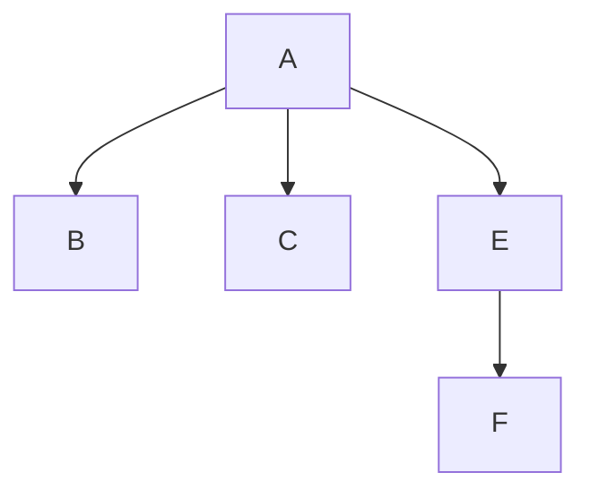
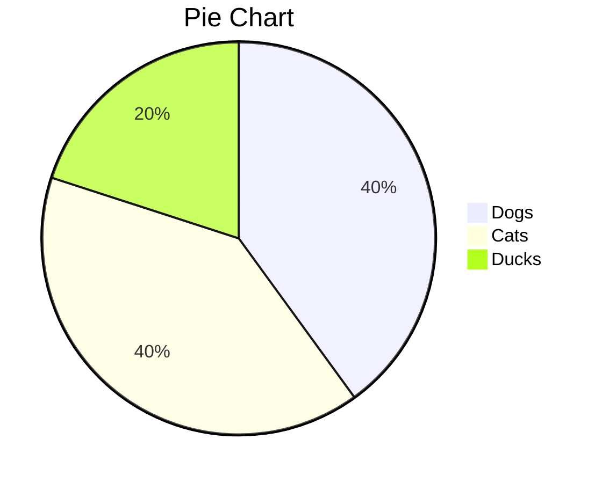
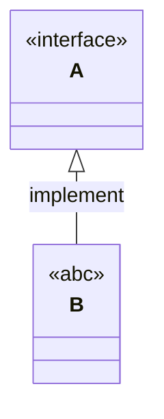

```sequence
Alice->Bob: Hello Bob, how are you?
Note right of Bob: Bob thinks
Bob-->Alice: I am good thanks!
Note left of Bob: who are you.
Note over Alice: rencai
```

```sequence
Title: abc
A->B: nothing
Note over A: hello
B-->D: no
Note right of D: D is bad
D->> A: ab
Note over A, B: wrong way
```








